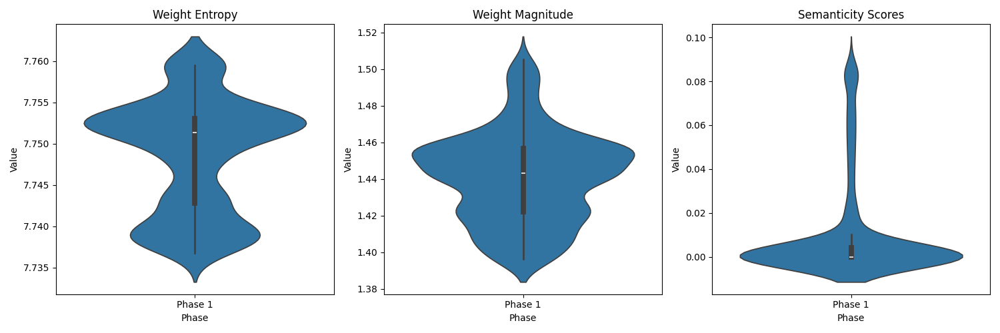
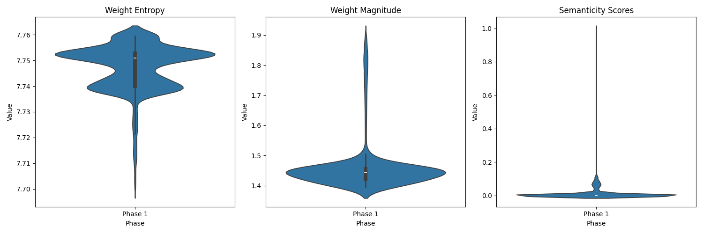
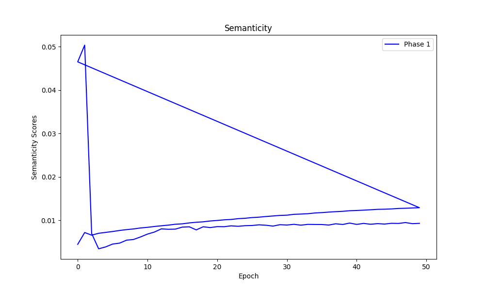

Title: Semanticity Weight Experiment Log 1
Date: 02/22/2025 20:38
Category: Experiment Logs

# Research Question: How do neural network weights evolve when neurons transition from monosemantic to polysemantic representations?

## Hypotheses
1. **Weight Distribution**: As neurons transition to polysemantic representations, their incoming weights become more distributed (less sparse).
   - Success Metric: Higher weight entropy in polysemantic neurons compared to monosemantic neurons.

2. **Weight Magnitude**: The magnitude of weight vectors increases to accommodate multiple feature representations.
   - Success Metric: Larger L2 norm of weight vectors in polysemantic neurons.

3. **Angular Distance**: The angular distance between weight vectors of different neurons decreases as they begin to capture overlapping concepts.
   - Success Metric: Decreased mean angular distance between neuron weight vectors in Phase 2.

## Work Done

#### Phase1 Plots 

#### Phase2 Plots 

## Confusions
- The graphs for phase 2 are all over the place. 

## Next Steps
- Inspect the graphs that have the odd distance changes 

## Relevant Literature
- [Polysemanticity vs Superposition](https://www.alignmentforum.org/posts/8EyCQKuWo6swZpagS/superposition-is-not-just-neuron-polysemanticity)
- [Engineering Monosemanticity](https://www.alignmentforum.org/posts/LvznjZuygoeoTpSE6/engineering-monosemanticity-in-toy-models)

